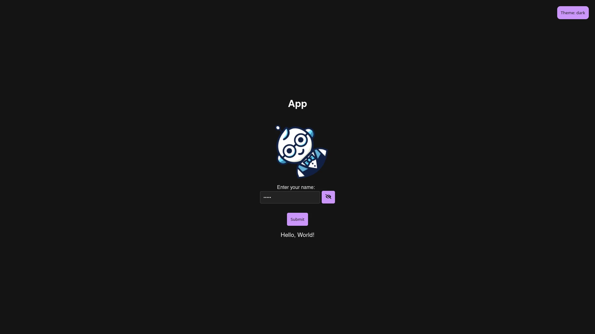

# My-Package

Insert a short description of the package here.



<!-- ## Features -->

## Installation

```bash
pip install my-package
```

## Usage

```shell
# or python -m py_package --port 8080
my_package --port 8080
# use my-package --help for more options
```

## Contributing

<!-- If the CONTRIBUTING.md file has a public url,
prefer using he url instead of the file path.
Why you ask? For example, the link in the PyPI page might not work.
-->

Please read [CONTRIBUTING.md](CONTRIBUTING.md) for details on our code of conduct, and the process for submitting pull requests.

> [!IMPORTANT]
>
> **Required files**
>
> - `pyproject.toml`: the project configuration file
> - `scripts/version.py`: the script to update the version
>   The script should expect the arguments `--set` or `--get`  
>    and it should either return `x.y.z` or set the version to `x.y.z`.
> - `scripts/clean.py`: the script to cleanup unwanted files
> - `scripts/format.py`: the script to format the code
> - `scripts/lint.py`: the script to lint the code
> - `scripts/test.py`: the script to run the tests
>   After tests, the script should generate a `coverage/lcov.info` file with the coverage report.
>
> **Optional files**
>
> - `scripts/docs.py`: the script to build the documentation
>   If the file exists, it should expect the argument: `--output`.
> - `scripts/build.py`: the script to build the package
>   If the file exists, it should expect the argument: `--output`.
>   It should also expect the optional argument: `--publish`
>   If the `--publish` argument is provided, the script should publish the package to the PyPI.
> - `scripts/image.py`: the script to build the Podman/Docker image:
>   It should expect the arguments:
>
>      - `--image-name`: the image name
>      - `--image-tag`: the image tag  
>     The script should build the image and tag it with the provided tag.
>     It should also expect the optional argument  
>      - `--push`. If the `--push` argument is provided, the script should push the image to one or more registries.  
>     Additional optional args can be provided to specify the target platforms and/or other build args like  
>      - `--platform`: the target platform

## Init

```shell
# python{3.10,3.11,3.12} -m venv .venv
python3 -m venv .venv
# or:
# uv venv --python 3.12 && uv pip install --upgrade pip
. .venv/bin/activate # or .venv\Scripts\activate.ps1
pip install --upgrade pip
# if not already:
# git init --initial-branch=main
pre-commit install
# optional:
# on windows: brew install make
make all
# Ths should produce:
# - dist/my_package-0.1.0-py3-none-any.whl
# - dist/my_package-0.1.0.tar.gz
# - coverage/lcov.info
# - coverage/coverage.xml
# - coverage/xunit.xml
# - coverage/html/*
# - site/*
# - image: localhost/my_repo/my_image:latest
# after git add:
# pre-commit run --all-files
```

## License

<!-- If the LICENSE file has a public url,
prefer using he url instead of the file path.
Why you ask? For example, the link in the PyPI page might not work.
-->

This project is licensed under the MIT License - see the [LICENSE](LICENSE) file for details.
